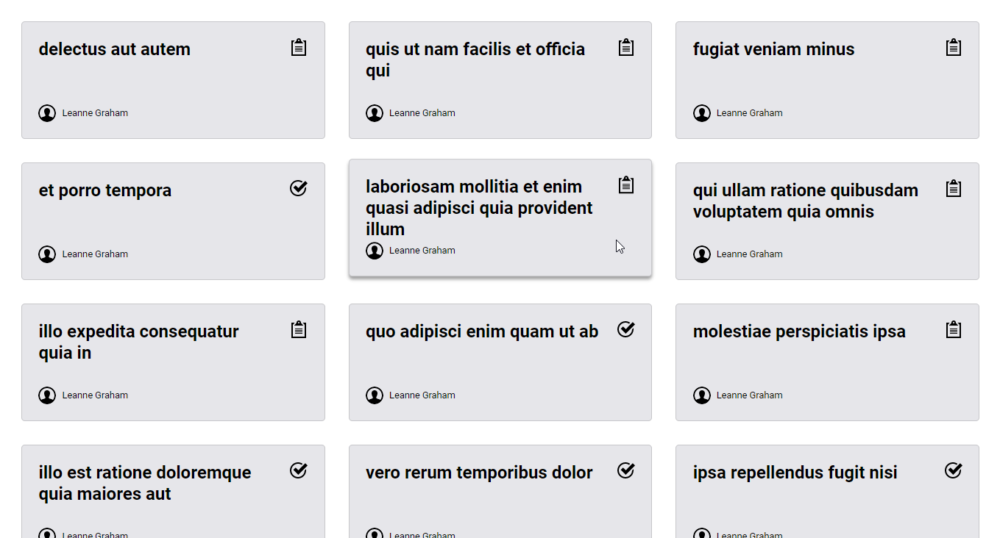

<h1 align="center">Consuming APIs</h1>

<p align="center">Created to practice API consumption both in Frontend and Backend</p>

<p align="center">
    <a href="https://github.com/diego-aquino">
        
    </a>
    
    <a>
        
    </a>
    <a href="./LICENSE">
        
    </a>
</p>

<p align="center">
    <a href="#rocket-features">Features</a>&nbsp;&nbsp;&nbsp;|&nbsp;&nbsp;&nbsp;
    <a href="#gear-technologies">Technologies</a>&nbsp;&nbsp;&nbsp;|&nbsp;&nbsp;&nbsp;
    <a href="#computer-getting-started">Getting started</a>&nbsp;&nbsp;&nbsp;|&nbsp;&nbsp;&nbsp;
    <a href="#newspaper_roll-license">License</a>&nbsp;&nbsp;&nbsp;|&nbsp;&nbsp;&nbsp;
    <a href="#handshake-acknowledgments">Acknowledgments</a>
</p>



---

## :rocket: Features

- Dynamic page generation:
    - Cards are created according to the data from JSONPlaceholder [/todos](https://jsonplaceholder.typicode.com/todos) and [/users](https://jsonplaceholder.typicode.com/users) APIs
- Responsive layout
- Card animation on mouse hover

## :gear: Technologies

The main technologies used in this project are the following:

- [JavaScript](https://developer.mozilla.org/en-US/docs/Web/JavaScript), [HTML](https://developer.mozilla.org/en-US/docs/Web/HTML) and [CSS](https://developer.mozilla.org/en-US/docs/Web/CSS)
- [Node.js](https://nodejs.org/en/) + [Express](https://expressjs.com/), [Axios](https://www.npmjs.com/package/axios) and [Cors](https://www.npmjs.com/package/cors)
- [VS Code](https://code.visualstudio.com/)

## :computer: Getting started

To clone and run this application, you'll need [Git](https://git-scm.com/), [Node.js](https://nodejs.org/en/) and [Yarn](https://yarnpkg.com/) installed on your computer. Then, from your command line:

```bash
# clone this repository
$ git clone https://github.com/diego-aquino/consuming-apis.git

# go to the created directory
$ cd consuming-apis/

# install all project dependencies automatically
$ yarn install

# start the api server
$ yarn start

# on another terminal tab, start the client server
$ yarn lite-server
```

Now you can visit `http://localhost:3000` to view this project running!

## :newspaper_roll: License

This project if under MIT License. Check [LICENSE](./LICENSE) for more information.

---

Made by [Diego Aquino](https://github.com/diego-aquino/) :sunglasses:. [Connect with me!](https://www.linkedin.com/in/diego-aquino) :wave:
